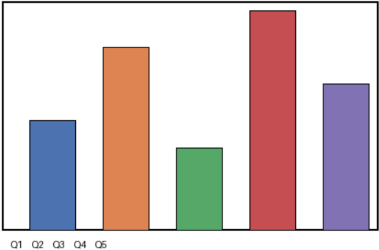

## Quarterly Operations Report

This report summarizes regional performance across recent quarters. The following table lists revenue figures by region, followed by a chart of quarterly totals.

| Region   |   Q1 |   Q2 |   Q3 |   Q4 |
|----------|------|------|------|------|
| North    |  120 |  135 |  150 |  160 |
| South    |   98 |  110 |  105 |  130 |
| East     |  145 |  150 |  160 |  175 |
| West     |   89 |   95 |  100 |  115 |
| Central  |  112 |  120 |  128 |  140 |

## Quarterly Totals

The figure below visualizes aggregate revenue for each quarter.

Figure 1. Aggregate quarterly revenue across all regions.

